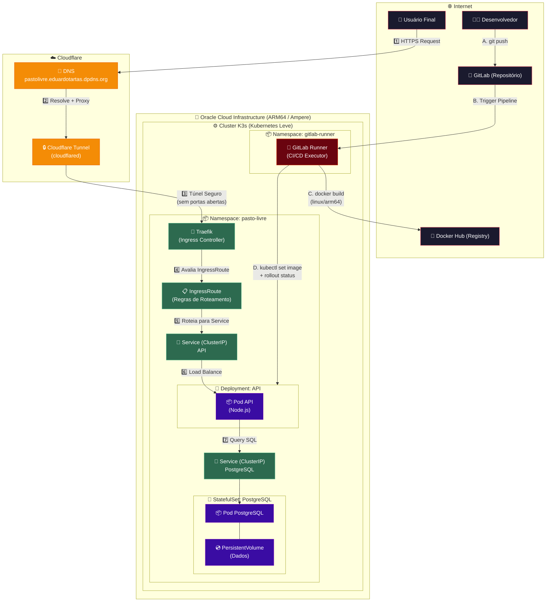
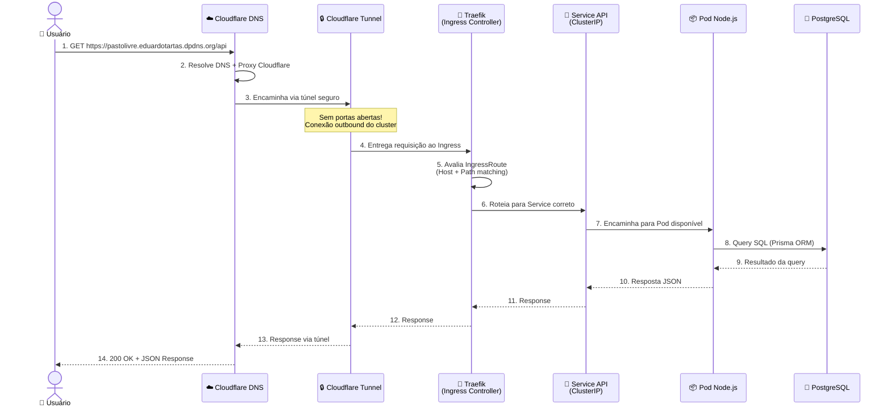
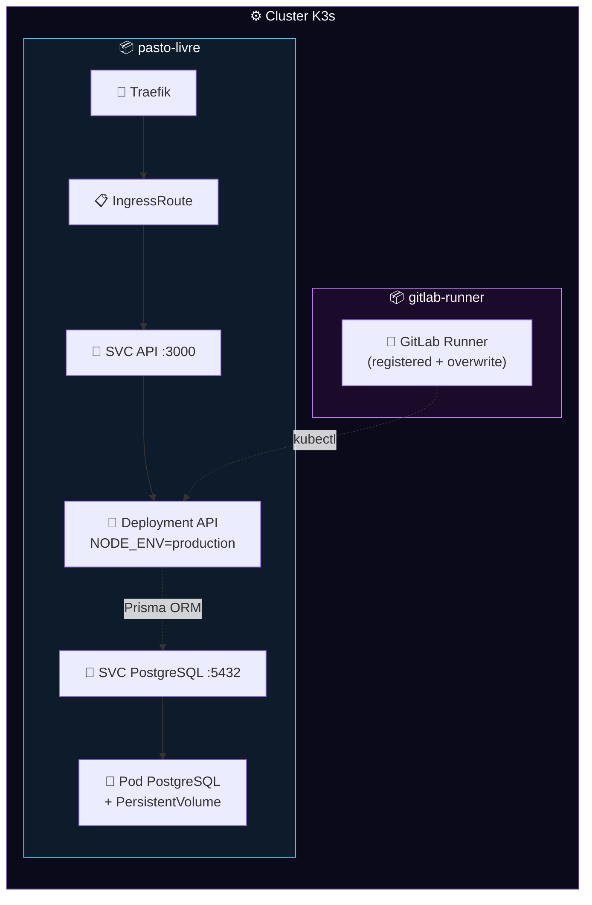

# 🏗️ Diagrama de Infraestrutura — Pasto Livre

## Arquitetura Completa (Fluxo de Requisição + CI/CD)

---

## Fluxo de CI/CD Detalhado (Pipeline GitLab)

```mermaid
sequenceDiagram
    actor Dev as 👨‍💻 Desenvolvedor
    participant GL as 🦊 GitLab
    participant Runner as 🏃 GitLab Runner<br/>(dentro do K3s)
    participant DH as 🐳 Docker Hub
    participant K3s as ⚙️ Cluster K3s
    participant API as 📦 Pod API

    Dev->>GL: 1. git push (branch main)
    GL->>Runner: 2. Dispara Pipeline CI/CD
    
    rect rgb(40, 40, 80)
        Note over Runner,DH: 🔨 Stage: Build
        Runner->>Runner: 3. docker buildx build<br/>--platform linux/arm64
        Runner->>DH: 4. docker push<br/>(imagem multi-arch)
    end
    
    rect rgb(20, 60, 40)
        Note over Runner,API: 🚀 Stage: Deploy
        Runner->>K3s: 5. kubectl set image<br/>deployment/gerenciamento-rural-api
        K3s->>K3s: 6. Cria novo Pod com imagem atualizada
        K3s->>API: 7. Health Check do novo Pod
        API-->>K3s: 8. Pod Ready ✅
        K3s->>K3s: 9. Termina Pod antigo (Rolling Update)
        Runner->>K3s: 10. kubectl rollout status<br/>(aguarda conclusão)
        K3s-->>Runner: 11. Rollout completo ✅
    end
    
    Runner-->>GL: 12. Pipeline Success ✅
    GL-->>Dev: 13. Notificação de sucesso
```

---

## Fluxo de Requisição do Usuário

---

## Estrutura dos Namespaces no Cluster

---

> [!NOTE]
> **Segurança**: Nenhuma porta é aberta no firewall da Oracle ou no roteador. Todo o tráfego externo passa pelo Cloudflare Tunnel, que mantém uma conexão **outbound** do cluster para a Cloudflare.

> [!TIP]
> **Após cada deploy**, faça um **Hard Refresh** (`Ctrl+Shift+R`) no navegador para limpar o cache e carregar os arquivos mais recentes.
